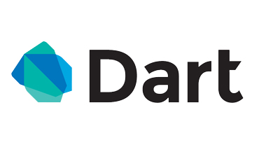
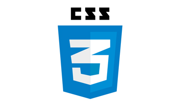
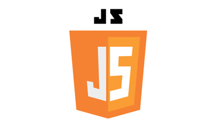

<html lang="en">
<link rel="stylesheet" href="/css/about.css"/>
	<body id="top">
		<!-- Header -->
		<header id="header">
			

				
				<h1><strong>My name is Kristen</strong>, and I'm a 
					Software Engineer located in Fayetteville, Ar.  
					I'm currently working at <a >Varsity Tutors</a>.
				</h1>
			

		</header>
		<!-- Main -->
		

			<section id="one">
				<header class="major">
					<h2>Hello!</h2>
				</header>
				
Thanks for checking out my portfolio. I'm a 23-year-old programmer currently thriving in downtown
					Fayetteville, Ar. I'm a proud alum of <a href="">University of Arkansas</a> where I 
					received my Bachelor's Degree in Computer Engineering. When I'm not at <a href="">Workiva</a>, I work as
					a freelance <a id="freelance" href="freelance.html">photographer/videographer</a>. I'm also what some would call
					a "music nerd" and enjoy playing a variety of instruments and rocking the <i>occasional</i> karaoke session.
				

				
For a closer look at the professional work I've done, check out my resume below. If you're interested in reaching out to me, feel free to <a href="mailto:Kris@kristensiearrablanks.com">contact me</a>. Cheers!

			</section>
			<section id="two">
				<header class="major">
					<h2>Work Experience</h2>
				</header>
				</ul>
				<ul class="actions">
					<li><a id="download" href="" class="button icon fa-download">Download Resume</a></li>
				</ul>
			</section>
			<section id="three">
				<header class="major">
					<h2>Skills</h2>
				</header>
				

					

						
<a href="https://www.dartlang.org/"></a>

						
<a href="https://www.python.org/"></a>

						
<a href="https://facebook.github.io/react/"></a>

						
<a href="https://www.w3schools.com/html/"></a>

						
<a href="https://developer.mozilla.org/en-US/docs/Web/CSS/CSS3"></a>

						
<a href="https://www.javascript.com/"></a>

					

				

			</section>
			<section id="four">
				<a id="blog"><h2>Blog</h2></a>
			</section>
			<section id="five">
				<h2>Get In Touch</h2>
				
If you have any questions or potential career opportunities, please feel free to contact me using this form.

				

					

						

							
<input type="text" name="name" id="name" placeholder="Name" />

							
<input type="email" name="email" id="email" placeholder="Email" />

							
<textarea name="message" id="message" placeholder="Message" rows="4"></textarea>

						

						 
						<ul class="actions">
							<li><input type="submit" value="Send Message" onclick="sendEmail()" /></li>
						</ul>
					

					

						<ul class="labeled-icons">
							<li>
								<h3 class="icon fa-home">Address</h3>
								Fayetteville, Ar
							</li>
							<li>
								<h3 class="icon fa-mobile">Phone</h3>
								901-277-55997
							</li>
							<li>
								<h3 class="icon fa-envelope-o">Email</h3>
								<a href="mailto:Kris@kristensiearrablanks.com">Kris@kristensiearrablanks.com</a>
							</li>
						</ul>
					

				

			</section>
		

		<!-- Footer -->
		<footer id="footer">
			

				<ul class="icons">
					<li><a id='twitter' href="https://twitter.com/KryptoPicasso" class="icon fa-twitter">Twitter</a></li>
					<li><a id='instagram' href="https://www.instagram.com/" class="icon fa-instagram">Instagram</a></li>
					<li><a id='github' href="https://github.com/kris777347" class="icon fa-github">Github</a></li>
					<li><a id='linkedin' href="https://www.linkedin.com/in" class="icon fa-linkedin">LinkedIn</a></li>
					<li><a href="mailto:Kris@kristensiearrablanks.com" class="icon fa-envelope-o">Email</a></li>
				</ul>
			

		</footer>
		</body>
		<!-- Scripts -->
		
		
		
		
		
		
		<!--[if lte IE 8]><![endif]-->
		
</html>